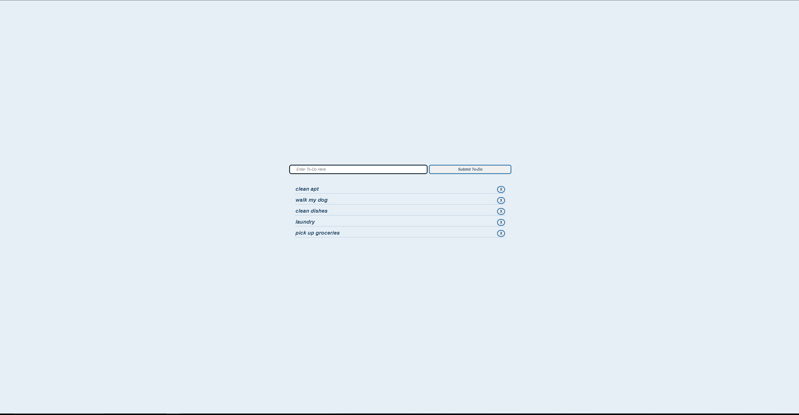

# Todo App

Todo app that was created with HTML/CSS and JavaScript

### Create your own to-do list [here]()

## Summary

To-Do application is a web-based task management system. The user interface is created using HTML forms, allowing users to input and submit tasks easily. CSS styling and positioning are applied to enhance the visual appeal and layout of the application, employing concepts like the box model for precise control over element spacing. JavaScript is utilized to enhance interactivity by implementing event listeners. These listeners respond to user actions, such as button clicks or form submissions. Additionally, DOM (Document Object Model) manipulation is employed to dynamically update the webpage content without requiring a full page reload. This allows for seamless and efficient task management.

## Author

David (Yun) Kim
